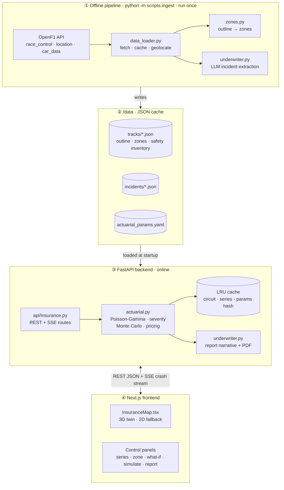
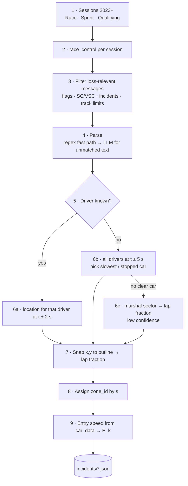
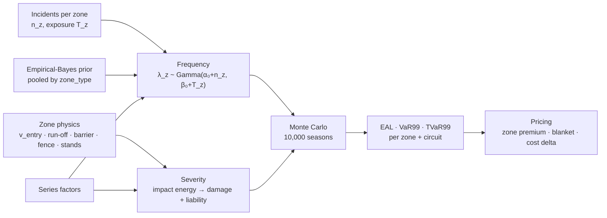

# FIA Assistant: Insurance Risk & Dynamic Underwriting Platform

> **Scope:** Module 2 only (Track-Zone Risk & Insurance). The Race Control module is out of scope for this document.
> **Status:** v2.0 hackathon baseline · **Audience:** all engineers
>
> This document is the **source of truth** for the insurance module's design, maths, API contracts and file ownership.
> If code and this document disagree, fix one of them in the same PR.

---

## Table of Contents

1. [Purpose & Principles](#1-purpose--principles)
2. [Tech Stack](#2-tech-stack)
3. [System Overview](#3-system-overview)
4. [Data Ingestion & Harmonisation](#4-data-ingestion--harmonisation)
5. [Actuarial Engine](#5-actuarial-engine)
6. [LLM Integration](#6-llm-integration)
7. [API Specification](#7-api-specification)
8. [Frontend: 3D Digital Twin](#8-frontend-3d-digital-twin)
9. [Repository Layout](#9-repository-layout)
10. [Team Delegation Matrix](#10-team-delegation-matrix)
11. [Running Locally](#11-running-locally)
12. [Non-Functional Requirements & Failure Modes](#12-non-functional-requirements--failure-modes)
13. [Assumptions & Open Questions](#13-assumptions--open-questions)

---

## 1. Purpose & Principles

**Problem.** Circuit owners, promoters and junior series (F2/F3) buy **blanket** property and liability cover, which prices a quiet straight like a high-energy braking zone. **Goal:** replace that with **zone-based, dynamic cover** driven by a spatial probabilistic model built from real OpenF1 incident and telemetry data.

**Target circuits:** Monza · Silverstone · Spa-Francorchamps. **Series:** F1 (observed), F2 and F3 (scaled).

| Principle | Consequence |
|---|---|
| **Transparent, auditable maths** | No neural nets or gradient boosting. Conjugate Bayesian frequency, physics-based severity, Monte Carlo aggregation. Every number traces back to a formula and a parameter. |
| **Uncertainty is first-class** | Every rate is shown with a credible interval. Zones with sparse data get wider bands. |
| **LLMs parse and explain, never compute** | The LLM extracts structured incidents and writes the narrative. All figures come from the deterministic engine and are passed to the LLM, never generated by it. |
| **Offline-first demo** | Ingestion runs once and caches to `/data`. The API and UI run with no internet, and without an API key (template report fallback). |
| **Assumptions are explicit** | Every non-observed parameter lives in `backend/config/actuarial_params.yaml`, marked with its provenance, and is shown in the UI. |

---

## 2. Tech Stack

| Layer | Technology | Purpose |
|---|---|---|
| API | **FastAPI** (Python 3.12+), Uvicorn, Pydantic v2 | REST + Server-Sent Events (SSE) |
| Maths | **NumPy**, **SciPy** (`scipy.stats.gamma`, `poisson`) | Poisson-Gamma posterior, Monte Carlo |
| Data source | **OpenF1 REST API** (`race_control`, `location`, `car_data`, `laps`, `sessions`) · FastF1 (optional) | Incidents, coordinates, speed traces |
| Storage | **Local JSON files** under `/data` (raw cache → processed → model cache) | Zero-infra, versionable, offline |
| LLM | **Claude** via the official **Anthropic Python SDK** (`anthropic`), model from `ANTHROPIC_MODEL` (default `claude-opus-5`) | Structured incident extraction, underwriter narrative |
| PDF | **ReportLab** | Server-side underwriter PDF |
| Frontend | **React / Next.js (App Router)**, TypeScript, **TailwindCSS** | App shell + control panels |
| 3D | **@react-three/fiber**, **@react-three/drei**, **three** (optional **@react-three/postprocessing** for bloom) | 3D digital twin |
| 2D fallback | Plain **SVG** | No-WebGL / low-power fallback |

**New backend dependencies** (added to `backend/requirements.txt` in one commit): `scipy`, `reportlab`, `pyyaml`.
**Frontend dependencies:** `next`, `react`, `tailwindcss`, `three`, `@react-three/fiber`, `@react-three/drei`, `@react-three/postprocessing` (optional).

---

## 3. System Overview



**Two planes:**
- **Offline pipeline** (`python -m scripts.ingest`): fetches OpenF1, geolocates incidents, builds zones, runs LLM extraction and writes JSON. Runs once, or whenever the data is refreshed.
- **Online API:** reads the JSON, runs the actuarial engine on demand (vectorised, < 300 ms), caches results by `(circuit, series, params_hash)` and serves the UI.

---

## 4. Data Ingestion & Harmonisation

Owner: **R1** · Files: `backend/services/data_loader.py`, `backend/services/zones.py`, `backend/services/openf1_client.py` (moved from `backend/app/data_sources.py`), `backend/scripts/ingest.py`

### 4.1 Pipeline



### 4.2 Coordinate mapping (critical)

Race-control `TRACK SECTOR n` values are **marshal sectors**, not the 3 timing sectors, so they cannot place an incident precisely. Placement is therefore driven by **`location` telemetry at the incident timestamp**:

1. `t₀ = race_control.date`. Parse the car numbers from `driver_number` or the message text (`"CARS 11 (PER) AND 23 (ALB)"`).
2. Query `location?session_key&driver_number&date>t₀−2s&date<t₀+2s`, and take the sample nearest `t₀`.
3. If no driver is named (e.g. `YELLOW IN TRACK SECTOR 15`), query all drivers over `t₀ ± 5 s` together with `car_data`, and select the car with the lowest speed (or speed < 30 km/h outside the pit lane).
4. Snap `(x, y)` to the nearest point of the circuit outline (KD-tree or brute force over ~400 points) → lap fraction `s`.
5. Store `geo_method ∈ {driver_location, inferred_slowest_car, marshal_sector}` and `geo_confidence ∈ {high, medium, low}`.

### 4.3 Zone construction (`services/zones.py`)

Zones are derived from the **real reference lap** already cached in `data/openf1/{circuit}_2024.json` (x, y, speed):

1. Compute cumulative distance and normalise the outline to `[0, 1]²` (aspect preserved).
2. Detect **braking zones** as speed local minima (window ±3 samples, v < 260 km/h, minima closer than 300 m merged). Each zone spans from the preceding speed maximum (braking point) to the corner exit.
3. The segments between braking zones become `straight` / `high_speed` zones. Target ~10–16 zones per circuit.
4. **Entry speed** `v_entry` = the speed at the braking point, from the reference trace.
5. Merge with the **hand-authored safety inventory** in `data/tracks/{circuit}.json` (names, barrier, run-off, fences, stands, asset values). See §13 A2.

`data/tracks/{circuit}.json`:

```jsonc
{
  "circuit": "monza",
  "name": "Autodromo Nazionale Monza",
  "length_m": 5793,
  "outline": [[0.121, 0.402], …],                  // normalised, ~400 pts
  "zones": [
    {
      "zone_id": "monza-parabolica",
      "name": "Curva Alboreto (Parabolica)",
      "zone_type": "braking",                      // braking | high_speed | straight | pit_lane
      "start_frac": 0.87, "end_frac": 0.93,
      "v_entry_kph": 331, "v_apex_kph": 179,
      "barrier_type": "tyre_wall",                 // tyre_wall | guardrail | tecpro | concrete
      "runoff_type": "gravel",                     // gravel | asphalt | grass
      "runoff_depth_m": 60,
      "fence_height_m": 4.0,
      "grandstand_capacity": 8000,
      "distance_to_stand_m": 45,
      "marshal_posts": 2,
      "asset_value_eur": 1200000,
      "inventory_source": "approximate (satellite imagery)"
    }
  ]
}
```

### 4.4 Incident record (`data/incidents/{circuit}.json`)

```jsonc
{
  "incident_id": "monza-2024-R-0017",
  "circuit": "monza", "season": 2024, "session_type": "Race", "session_key": 9590,
  "lap": 22, "occurred_at": "2024-09-01T13:41:07Z",
  "raw_message": "YELLOW IN TRACK SECTOR 15",
  "car_numbers": [31],
  "turn_number": 11,
  "incident_type": "stopped",                      // crash | spin | stopped | debris | collision | track_limits
  "severity_score": 0.55,                          // 0..1, extractor estimate
  "loss_relevant": true,                           // false for track_limits / admin messages
  "x": 0.812, "y": 0.221, "lap_frac": 0.901,
  "zone_id": "monza-parabolica",
  "geo_method": "inferred_slowest_car", "geo_confidence": "medium",
  "entry_speed_kph": 331, "kinetic_energy_kj": 3372.4,
  "extraction": { "method": "llm", "model": "claude-opus-5" }
}
```

**Kinetic energy at zone entry:** `E_k = ½ · m · v²`, with `m = 798 kg` (F1 minimum car mass incl. driver, parameterised) and `v` in m/s. For example, 331 km/h ≈ 91.9 m/s gives E_k ≈ 3.37 MJ.

### 4.5 Series risk scaling (F1 → F2 / F3)

F2 and F3 race at the same circuits but have no OpenF1 telemetry. Their risk is derived from the F1 zone baseline using a deterministic multiplier matrix (defaults from the product spec; all **assumptions**, editable in `actuarial_params.yaml`):

| Series | GridFactor | ErrorFactor | EnergyFactor | Applied to |
|---|---|---|---|---|
| F1 | 1.0 | 1.0 | 1.0 | baseline |
| F2 | 1.1 | 1.3 | 0.8 | |
| F3 | 1.5 | 1.8 | 0.6 | |

$$\text{Risk}_{s} = \text{Risk}_{F1} \times \text{Grid}_s \times \text{Error}_s \times \text{Energy}_s$$

**How it is applied in the engine** (equivalent to the formula for the linear part, but faithful to the non-linear severity curve):
- **Frequency:** `λ_s = λ_F1 × Grid_s × Error_s` (more cars, more mistakes).
- **Severity:** `E_k,s = E_k,F1 × Energy_s`. The factor is applied **before** the non-linear barrier/breach functions, so lower-energy F3 cars are correctly less likely to breach fences, rather than scaling the final loss linearly.

---

## 5. Actuarial Engine

Owner: **R2** · File: `backend/services/actuarial.py` (pure NumPy/SciPy, no I/O, no FastAPI imports) · Params: `backend/config/actuarial_params.yaml`

### 5.1 Pipeline



### 5.2 Frequency: Bayesian Poisson-Gamma (conjugate)

For zone *z* with `n_z` loss-relevant incidents over exposure `T_z` (session-equivalents):

- **Likelihood:** `n_z | λ_z ~ Poisson(λ_z · T_z)`
- **Prior:** `λ_z ~ Gamma(α₀, β₀)` (shape/rate)
- **Posterior:** `λ_z | n_z ~ Gamma(α₀ + n_z, β₀ + T_z)`
- **Posterior mean:** `(α₀ + n_z) / (β₀ + T_z)`
- **90% credible interval:** `scipy.stats.gamma.ppf([0.05, 0.95], a=α₀+n_z, scale=1/(β₀+T_z))`

**Exposure `T_z`:** sessions weighted by track time: Race = 1.0, Sprint = 0.35, Qualifying = 0.25 (assumptions), summed over 2023+ sessions at the circuit.

**Prior (empirical Bayes, pooled by zone type):** across all zones of the same `zone_type` over all 3 circuits, compute pooled rate mean `m` and variance `v` of the observed rates `n_z / T_z`. Then by method of moments `α₀ = m² / v`, `β₀ = m / v`, with floors (`α₀ ≥ 0.5`) so that the prior stays weakly informative. **Effect:** a zone with 0 incidents in 4 sessions gets a small but non-zero rate with a wide interval. It is not declared "risk-free".

### 5.3 Severity: physics prior

For each simulated crash in zone *z*:

1. **Speed leaving the track:** `v_off = v_entry · U`, with `U ~ Beta(a_u, b_u)` (fraction of entry speed retained at departure).
2. **Speed at the barrier after the run-off:** `v_b = sqrt(max(0, v_off² − 2 · a_runoff · d_runoff))`, where `a_runoff = μ_surface · g` depends on the run-off surface.
3. **Impact energy:** `E_b = ½ · m · v_b² · Energy_s`.
4. **Energy transmitted past the barrier:** `E_t = E_b · (1 − absorption[barrier])`.
5. **Loss components (EUR):**
   - **Material damage:** `L_prop = min(asset_value_z, c_repair[barrier] · E_b)`. Repair cost is proportional to impact energy and capped at the zone's asset value.
   - **Spectator liability:** `P_breach = σ((E_t − E_crit(fence_height)) / s_breach)` (logistic); `L_liab ~ Bernoulli(P_breach) · exposure_z · claim_severity`, where `exposure_z = f(grandstand_capacity, distance_to_stand_m)`.
   - **Marshal personal accident:** `L_pa = Bernoulli(p_pa · marshal_posts · 1[E_t > E_pa]) · pa_benefit`.
   - `L = L_prop + L_liab + L_pa`

Parameter table (`actuarial_params.yaml`). **All values are illustrative placeholders to be tuned; none are actuarial fact:**

| Parameter | Default | Note |
|---|---|---|
| `car_mass_kg.f1` | 798 | F1 minimum mass incl. driver |
| `g` | 9.81 | |
| `mu_surface` | gravel 0.9 · grass 0.4 · asphalt 0.6 | effective deceleration of an off-track car in g |
| `absorption` | tyre_wall 0.55 · guardrail 0.35 · tecpro 0.75 · concrete 0.10 | share of impact energy absorbed |
| `c_repair_eur_per_kj` | tyre_wall 15 · guardrail 40 · tecpro 25 · concrete 60 | material damage per kJ |
| `E_crit_kj(fence_h)` | `400 · fence_h` | energy needed to breach a debris fence |
| `retained_speed_beta` | a = 4, b = 3 | U distribution |
| `session_weights` | R 1.0 · S 0.35 · Q 0.25 | exposure |
| `sessions_per_season` | R 1 · S 0–1 · Q 1 (per circuit, per series) | one race weekend = one season at that circuit |

### 5.4 Monte Carlo engine

For each `(circuit, series)` with `N = 10,000` seasons (seeded `np.random.default_rng(seed)`, fully vectorised):

```
for each zone z (vectorised over seasons):
    λ[i]      ~ Gamma(α₀+n_z, β₀+T_z) × Grid_s × Error_s     # parameter uncertainty per season
    K[i]      ~ Poisson(λ[i] · W_season)                      # number of crashes in season i
    crashes   = draw sum(K) severities (§5.3)                 # flat array
    loss[i,z] = np.add.reduceat / bincount(crash_losses, season_index)
circuit_loss[i] = Σ_z loss[i,z]
```

**Outputs:**

| Metric | Definition |
|---|---|
| `EAL_z` | `mean(loss[:, z])` |
| `VaR99_z` | `quantile(loss[:, z], 0.99)` |
| `TVaR99_z` | `mean(loss[loss[:, z] ≥ VaR99_z, z])` (bonus: expected shortfall) |
| `crash_prob_z` | `P(K ≥ 1)` per season |
| `share_of_loss_z` | `EAL_z / Σ EAL` (feeds "Parabolica carries 31% of expected loss") |
| Circuit `EAL`, `VaR99` | computed on `circuit_loss`, so **diversification** is captured: `VaR99_circuit ≤ Σ VaR99_z` |
| Convergence | running mean and SE of EAL (`std/√N`), reported and streamed |

The engine returns (optionally) a **sample of simulated crash events** `(season, zone_id, lap_frac, x, y, loss_eur, energy_kj)` for the "Simulate Season" animation.

### 5.5 Pricing

| Quantity | Formula |
|---|---|
| **Tail risk margin** | `TRM_z = r_coc · (VaR99_z − EAL_z)` (cost-of-capital on the unexpected loss; `r_coc` default 0.10) |
| **Zone premium** | `P_z = EAL_z · (1 + θ_expense) + TRM_z` (`θ_expense` default 0.15) |
| **Recommended cover limit** | `Limit_z = min(asset_value_z + liability_cap_z, VaR99_z)`, rounded up |
| **Blanket premium** | Uniform rate on total insured value: `P_blanket = ρ · TIV`, with `ρ = [EAL_c(1+θ) + r_coc(VaR99_c − EAL_c)] · (1 + ambiguity_load) / TIV_ref`. The ambiguity load (default 0.35) prices the insurer's lack of spatial information. |
| **Segmented premium** | `P_seg = Σ_z P_z` |
| **Cost delta** | `Δ = P_blanket − P_seg` and `Δ% = Δ / P_blanket` |
| **Risk score** | 0–100 from the percentile rank of `EAL_z` within the circuit; tiers LOW < 25 ≤ MEDIUM < 60 ≤ HIGH < 85 ≤ CRITICAL |

### 5.6 Safety what-if

1. Apply the requested changes to one zone (e.g. `barrier_type: tyre_wall → tecpro`, `runoff_depth_m +20`, `fence_height_m +1`).
2. Re-simulate **that zone only** with the **same RNG seed** (common random numbers), so the delta reflects the upgrade rather than Monte Carlo noise.
3. Return `ΔEAL`, `ΔVaR99`, `ΔP_z`, and the circuit totals.
4. **Payback period:** `upgrade_cost / (ΔP_z + ΔEAL_retained)` in years, from the upgrade catalogue in `actuarial_params.yaml` (e.g. `tecpro: €/m`, `fence: €/m per metre of height`, `gravel: €/m²`; illustrative costs).

Upgrades change **severity only**. A barrier doesn't change how often cars leave the track.

### 5.7 Public interface of `actuarial.py`

```python
@dataclass(frozen=True)
class SeriesFactors: grid: float; error: float; energy: float

def posterior_rate(n: int, exposure: float, alpha0: float, beta0: float,
                   ci: float = 0.90) -> RateEstimate: ...            # mean, lo, hi, alpha, beta

def fit_empirical_prior(rates: np.ndarray, exposures: np.ndarray) -> tuple[float, float]: ...

def impact_energy(v_entry_kph: np.ndarray, zone: Zone, params: Params,
                  energy_factor: float, rng: np.random.Generator) -> np.ndarray: ...

def crash_loss(energy_kj: np.ndarray, zone: Zone, params: Params,
               rng: np.random.Generator) -> LossBreakdown: ...      # prop, liab, pa, total

def simulate_circuit(circuit: Circuit, incidents: list[Incident], series: str,
                     params: Params, n_seasons: int = 10_000, seed: int = 42,
                     return_events: int = 0) -> SimulationResult: ...

def price(result: SimulationResult, circuit: Circuit, params: Params) -> PricingResult: ...

def what_if(circuit: Circuit, incidents: list[Incident], series: str, zone_id: str,
            changes: ZoneChanges, params: Params, seed: int = 42) -> WhatIfResult: ...
```

**Testing (required):**
- The posterior mean matches the closed form.
- The CI gets narrower as `T` grows.
- With `n = 0`, λ > 0.
- `E_k(331 km/h, 798 kg) ≈ 3.37 MJ`.
- TecPro EAL < tyre-wall EAL for the same seed.
- `VaR99_circuit ≤ Σ VaR99_z`.
- F3 frequency = F1 × 2.7.
- Fixed-seed results are deterministic.

---

## 6. LLM Integration

Owner: **R1** (extraction) · **R3** (report) · File: `backend/services/underwriter.py`

**Client:** `anthropic.AsyncAnthropic()` (reads `ANTHROPIC_API_KEY`). Model: `settings.anthropic_model` (default `claude-opus-5`). Structured output uses the SDK's Pydantic helper `client.messages.parse(..., output_format=<PydanticModel>)`, so responses are schema-validated.

### 6.1 Incident extraction

- **When:** offline, during ingestion. Results are cached in `data/incidents/*.json`, so the LLM is **never on the request path**.
- **Two-tier parser:**
  1. **Regex fast path** for the formulaic messages (`YELLOW IN TRACK SECTOR n`, `CAR n (ABC) … TRACK LIMITS AT TURN t`, `SAFETY CAR DEPLOYED`, `RED FLAG`).
  2. **LLM** for everything unmatched (free-text incident notes, multi-car collisions), **batched** at ~25 messages per call.
- **Schema:**

```python
class ExtractedIncident(BaseModel):
    message_index: int
    car_numbers: list[int]
    turn_number: int | None
    incident_type: Literal["crash", "spin", "stopped", "debris", "collision",
                           "track_limits", "flag_only", "administrative"]
    severity_score: float = Field(ge=0, le=1)
    loss_relevant: bool
    rationale: str

class ExtractionBatch(BaseModel):
    incidents: list[ExtractedIncident]
```

- **Guardrails:**
  - The prompt forbids inventing car or turn numbers that aren't in the text.
  - `message_index` must map back to an input row, and unknown indices are dropped.
  - Regex results win over LLM results when both parse a message.

### 6.2 Underwriter report

- **Input:** the deterministic `PricingResult` + top zones + series factors + assumptions list, serialised as JSON.
- **Output schema:**

```python
class UnderwriterReport(BaseModel):
    executive_summary: str                 # 3–5 sentences
    risk_concentrations: list[ZoneFinding] # zone_id, headline, share_of_loss_pct, drivers[]
    exposure_drivers: list[str]
    premium_recommendations: list[Recommendation]  # zone_id, action, rationale, est_saving_eur
    safety_recommendations: list[Recommendation]
    caveats: list[str]
```

- **Numeric integrity:**
  - The prompt instructs the model to only quote numbers present in the input.
  - After generation, every number in the text is checked against the input figures (±0.5% tolerance). Any mismatch falls back to the **template narrative** (deterministic f-strings), which is also used when no API key is set.
- **Export:**
  - `format=json`: the report plus the full pricing tables.
  - `format=pdf`: built with ReportLab: cover, summary, zone table, 2D track heat-map image (SVG → PNG via ReportLab graphics), assumptions page.
  - Reports are cached by `(circuit, series, params_hash)`.

---

## 7. API Specification

Owner: **R3** · Files: `backend/main.py` (app factory, CORS, router mount), `backend/api/insurance.py` (routes), `backend/api/schemas.py` (Pydantic request/response models)

Conventions: `circuit ∈ {monza, silverstone, spa}`, `series ∈ {f1, f2, f3}` (lowercase), money in EUR (numbers), fractions in `[0, 1]`.

| Method | Path | Purpose | Target latency |
|---|---|---|---|
| GET | `/api/health` | `{status, data_loaded, llm_configured}` | < 10 ms |
| GET | `/api/insurance/circuits` | Circuits + zone counts + data coverage | < 20 ms |
| GET | `/api/insurance/risk-map?circuit&series` | Zones + risk metrics + totals + outline | < 300 ms cold / < 20 ms cached |
| GET | `/api/insurance/zones/{zone_id}?series` | Zone detail + incident history + posterior | < 50 ms |
| GET | `/api/insurance/incidents?circuit&zone_id` | Processed incident records | < 50 ms |
| POST | `/api/insurance/incidents/ingest` | Trigger (re-)ingestion + LLM extraction for a circuit (admin / background task) | async (returns `job_id`) |
| POST | `/api/insurance/simulate` | Full 10,000-season Monte Carlo summary + sampled crash events | < 500 ms |
| GET | `/api/insurance/simulate/stream?circuit&series&seasons=50` | **SSE**: streams crash events for animation + running EAL convergence | streams over ~10–20 s |
| POST | `/api/insurance/what-if` | Zone upgrade → recomputed zone + totals + payback | < 300 ms |
| GET | `/api/insurance/report/export?circuit&series&format=json\|pdf` | Underwriter report | ≤ 8 s with LLM (cached after) |

> `POST /api/insurance/simulate-season` is accepted as an alias of `/simulate`.

### 7.1 `GET /api/insurance/risk-map`

```jsonc
{
  "circuit": { "id": "monza", "name": "Autodromo Nazionale Monza", "outline": [[0.12, 0.40], …] },
  "series": "f2",
  "series_factors": { "grid": 1.1, "error": 1.3, "energy": 0.8 },
  "params_hash": "a91f…", "n_seasons": 10000, "seed": 42,
  "totals": {
    "eal_eur": 1840000, "var99_eur": 6100000, "tvar99_eur": 7900000,
    "blanket_premium_eur": 2950000, "segmented_premium_eur": 2210000,
    "cost_delta_eur": 740000, "cost_delta_pct": 25.1,
    "diversification_benefit_eur": 2300000
  },
  "zones": [
    {
      "zone_id": "monza-parabolica", "name": "Curva Alboreto (Parabolica)", "zone_type": "braking",
      "start_frac": 0.87, "end_frac": 0.93, "centroid": { "x": 0.81, "y": 0.22 },
      "risk_score": 91, "risk_tier": "CRITICAL",
      "crash_rate": { "mean": 0.42, "lo90": 0.21, "hi90": 0.71, "n_incidents": 9, "exposure": 7.6 },
      "crash_prob_season": 0.58,
      "energy_kj_mean": 2140,
      "eal_eur": 410000, "var99_eur": 1650000, "share_of_loss_pct": 22.3,
      "premium_eur": 505000, "tail_risk_margin_eur": 124000,
      "recommended_limit_eur": 1650000,
      "safety": { "barrier_type": "tyre_wall", "runoff_type": "gravel", "runoff_depth_m": 60,
                  "fence_height_m": 4.0, "grandstand_capacity": 8000, "marshal_posts": 2 }
    }
  ],
  "assumptions": ["F2/F3 derived from F1 via series factors", "Safety inventory approximate", "…"]
}
```

> All figures above are illustrative mock values.

### 7.2 `POST /api/insurance/what-if`

```jsonc
// request
{ "circuit": "monza", "series": "f2", "zone_id": "monza-parabolica",
  "changes": { "barrier_type": "tecpro", "runoff_depth_m": 80, "fence_height_m": 5.0 } }
// response
{ "zone_id": "monza-parabolica",
  "before": { "eal_eur": 410000, "var99_eur": 1650000, "premium_eur": 505000, "risk_score": 91 },
  "after":  { "eal_eur": 262000, "var99_eur": 980000,  "premium_eur": 318000, "risk_score": 74 },
  "delta":  { "eal_eur": -148000, "premium_eur": -187000 },
  "upgrade_cost_eur": 420000, "payback_years": 1.25,
  "totals_after": { "segmented_premium_eur": 2023000, "cost_delta_pct": 31.4 } }
```

### 7.3 `GET /api/insurance/simulate/stream` (SSE)

Why SSE rather than WebSocket: this stream is one-way (server → client), works over plain HTTP, and needs no connection manager.

The 10,000-season run itself completes in < 500 ms. The stream **replays a sample of simulated seasons** at a watchable pace, with the full-run statistics converging alongside.

```
event: season_start
data: {"season": 7}

event: crash
data: {"season": 7, "zone_id": "monza-parabolica", "x": 0.812, "y": 0.221, "energy_kj": 1840, "loss_eur": 96000, "breach": false}

event: progress
data: {"seasons_done": 7, "running_eal_eur": 1795000, "se_eur": 88000}

event: done
data: {"n_seasons": 10000, "eal_eur": 1840000, "var99_eur": 6100000}
```

### 7.4 Error envelope

`{"error": {"code": "UNKNOWN_CIRCUIT", "message": "…", "detail": {…}}}`, returned with 400/404/422/500.

---

## 8. Frontend: 3D Digital Twin

Owners: **R4** (3D scene + 2D fallback) · **R3** (panels + data hooks) · Route: `frontend/app/insurance/page.tsx`

### 8.1 Component tree

```
app/insurance/page.tsx
└── InsuranceMap.tsx                       # R4: layout, state, WebGL detection, 3D ↔ 2D switch
    ├── scene/TrackScene3D.tsx             # R4: <Canvas>, lights, camera, <OrbitControls>
    │   ├── scene/TrackRibbon.tsx          # R4: outline → extruded ribbon BufferGeometry
    │   ├── scene/BarrierWalls.tsx         # R4: per-zone wall strips, emissive green→red
    │   ├── scene/Grandstands.tsx          # R4: boxes, height ∝ capacity, offset outward
    │   ├── scene/HeatColumns.tsx          # R4: cylinders, height ∝ EAL, glow
    │   ├── scene/CrashDrops.tsx           # R4: spheres falling onto the track from SSE events
    │   └── scene/ZonePicker.tsx           # R4: invisible hit meshes → onZoneClick
    ├── fallback/TrackMap2D.tsx            # R4: SVG path + coloured zone segments + markers
    └── panels/                            # R3
        ├── ControlBar.tsx                 # circuit select + SeriesToggle (F1/F2/F3) + 3D/2D switch
        ├── PremiumSummary.tsx             # blanket vs segmented, cost delta, EAL, VaR99
        ├── ZonePanel.tsx                  # incident history, λ mean + 90% band, EAL, limit
        ├── WhatIfPanel.tsx                # barrier/run-off/fence toggles → deltas + payback
        ├── SimulatePanel.tsx              # "Simulate Season" + live loss counter + convergence
        ├── AssumptionsDrawer.tsx          # series factors + params provenance
        └── ReportButton.tsx               # JSON / PDF export
hooks/  useRiskMap.ts · useWhatIf.ts · useSimulationStream.ts (EventSource)   # R3
lib/    api.ts · types.ts · riskColors.ts (shared colour scale) · geometry.ts   # R3 · R3 · R4 · R4
```

### 8.2 3D scene specification

| Element | Implementation |
|---|---|
| **Coordinate system** | Normalised outline `[0,1]²` → world XZ plane scaled to ~100 units; Y is up |
| **Track ribbon** | For each outline point compute the tangent and normal, offset ±w/2 → triangle strip `BufferGeometry`, dark asphalt material; start/finish line decal |
| **Barrier walls** | For each zone, slice the outline between `start_frac` and `end_frac`, offset to the outside of the corner (sign of curvature), extrude height 1.2 units; `meshStandardMaterial` with `emissive = riskColor(score)`, `emissiveIntensity` ∝ score |
| **Grandstands** | Box at zone centroid + outward normal × `distance_to_stand_m` (scaled); height ∝ `grandstand_capacity`; tinted by exposure |
| **Heat columns** | Cylinder at the zone centroid; height ∝ `eal_eur` (sqrt-scaled); translucent emissive; value label via drei `<Html>` on hover |
| **Crash drops** | For each SSE `crash`: sphere spawned at y = 20 above `(x, y)`, falls with ease-out, flashes on impact (red if `breach`), fades after 2 s; pooled meshes (max 200) |
| **Glow** | `@react-three/postprocessing` `<Bloom>` (optional, disabled on low-power devices) |
| **Interaction** | Raycast click on `ZonePicker` meshes → `selectedZoneId`; the camera eases toward the zone (drei `CameraControls` or lerp) |
| **Transitions** | On series or what-if change, colours and heights tween over 400 ms (no remount) |
| **Fallback** | `InsuranceMap` renders `TrackMap2D` if WebGL is unavailable, `prefers-reduced-motion` is set, or the user picks 2D. The props are identical. |

### 8.3 Shared props contract (R3 ↔ R4)

```ts
export type ZoneVisual = {
  zoneId: string; name: string; startFrac: number; endFrac: number;
  centroid: { x: number; y: number };
  riskScore: number; ealEur: number; grandstandCapacity: number; breachProb?: number;
};

export type CrashEvent = { id: string; zoneId: string; x: number; y: number; lossEur: number; breach: boolean };

export type InsuranceMapViewProps = {
  outline: [number, number][];
  zones: ZoneVisual[];
  crashes: CrashEvent[];            // appended by useSimulationStream
  selectedZoneId?: string;
  onZoneClick: (zoneId: string) => void;
};
// TrackScene3D and TrackMap2D both implement InsuranceMapViewProps.
```

### 8.4 Interaction flows

| Control | Flow |
|---|---|
| **Series toggle** | `useRiskMap(circuit, series)` → `GET /risk-map` → zones re-coloured with a tween; PremiumSummary animates the numbers |
| **Zone click** | `selectedZoneId` → `GET /zones/{id}?series` → ZonePanel (incident list, λ band chart, EAL, VaR99, limit, safety inventory) |
| **Simulate season** | `EventSource(/simulate/stream)` → `crash` events → `CrashDrops`; `progress` → live counter + convergence sparkline; `done` → final totals |
| **Safety what-if** | Barrier/run-off/fence toggles → debounced `POST /what-if` → the zone's wall colour, column height, premium and payback update in place; "Reset" restores the baseline |
| **Report** | `GET /report/export?format=pdf` → download; `format=json` → view in a drawer |

---

## 9. Repository Layout

```
FIA_ASSISTANT/
├── ARCHITECTURE.md
├── README.md
├── .env.example
├── backend/
│   ├── main.py                          # R3  FastAPI app, CORS, router mount
│   ├── requirements.txt                 # R3  (+ scipy, reportlab, pyyaml)
│   ├── config/
│   │   ├── settings.py                  # R3  pydantic-settings (env)
│   │   └── actuarial_params.yaml        # R2  all model parameters + provenance
│   ├── api/
│   │   ├── insurance.py                 # R3  routes (§7)
│   │   └── schemas.py                   # R3  request/response models (R2 reviews)
│   ├── services/
│   │   ├── openf1_client.py             # R1  (moved from app/data_sources.py)
│   │   ├── data_loader.py               # R1  fetch, cache, geolocate, energy
│   │   ├── zones.py                     # R1  outline → zones, merge safety inventory
│   │   ├── actuarial.py                 # R2  pure maths (§5)
│   │   ├── underwriter.py               # R1 extraction · R3 report + PDF
│   │   └── repository.py                # R3  load /data JSON, LRU cache
│   ├── scripts/
│   │   ├── fetch_openf1.py              # R1  (exists) reference laps
│   │   └── ingest.py                    # R1  full pipeline → data/incidents, data/tracks
│   └── tests/
│       ├── test_actuarial.py            # R2
│       ├── test_data_loader.py          # R1
│       └── test_api.py                  # R3
├── data/
│   ├── openf1/                          # R1  raw cache (reference laps exist)
│   ├── tracks/{circuit}.json            # R1  outline + zones + safety inventory
│   ├── incidents/{circuit}.json         # R1  processed incidents
│   └── mocks/                           # R3  frontend fixtures (risk_map_monza_f2.json, what_if.json, stream.txt)
└── frontend/
    ├── package.json                     # R3
    ├── app/layout.tsx, globals.css      # R3
    ├── app/insurance/page.tsx           # R4
    ├── components/insurance/
    │   ├── InsuranceMap.tsx             # R4
    │   ├── scene/*                      # R4
    │   ├── fallback/TrackMap2D.tsx      # R4
    │   └── panels/*                     # R3
    ├── hooks/*                          # R3
    └── lib/{api,types}.ts               # R3 · lib/{riskColors,geometry}.ts R4
```

---

## 10. Team Delegation Matrix

### 10.1 Ground rules

1. **Exclusive file ownership** as tagged in §9. To change another owner's file, open a PR and tag them.
2. **Contract freeze at H+2:** `api/schemas.py`, `data/mocks/*`, `lib/types.ts` and the §8.3 props. Later changes update schema, mock and types in **one** PR.
3. **Mock-first:** the frontend builds on `data/mocks/*` from H+2. R3 serves the mocks from the real routes (`MOCK_MODE=1`) by H+4.
4. **Pure core:** `actuarial.py` has no I/O and no FastAPI imports. R2 tests it in isolation against fixtures.
5. Branches `r1/*` … `r4/*` → PR into `main`. Rebase twice a day, and never force-push `main`.

### 10.2 Roles

| | **R1: Data & Extraction** | **R2: Actuarial Engine** | **R3: API, Reports & Panels** | **R4: 3D Digital Twin** |
|---|---|---|---|---|
| **Mission** | Real incidents on the right spot of the map | Numbers an underwriter would sign | Serve it, explain it, control it | Make risk visible in 3D |
| **Owns** | `services/{openf1_client,data_loader,zones}.py`, extraction half of `underwriter.py`, `scripts/*`, `data/{openf1,tracks,incidents}` | `services/actuarial.py`, `config/actuarial_params.yaml`, `tests/test_actuarial.py` | `main.py`, `api/*`, `config/settings.py`, `services/repository.py`, report half of `underwriter.py`, `data/mocks`, `frontend/{package.json,app/layout.tsx,hooks,lib/api.ts,lib/types.ts}`, `components/insurance/panels/*` | `app/insurance/page.tsx`, `components/insurance/{InsuranceMap.tsx,scene/*,fallback/*}`, `lib/{riskColors,geometry}.ts` |
| **Produces** | `data/tracks/*.json`, `data/incidents/*.json` | `simulate_circuit`, `price`, `what_if` | REST + SSE, PDF/JSON report, panels | 3D scene + 2D fallback |
| **Consumes** | OpenF1 | R1's JSON (fixtures until ready) | R2's functions, R1's JSON | R3's hooks/types (mocks until ready) |

### 10.3 Deliverables & checkpoints

| Hour | R1: Data & Extraction | R2: Actuarial | R3: API, Reports & Panels | R4: 3D Twin |
|---|---|---|---|---|
| **H+2** | Zone schema agreed; `zones.py` on the cached Monza lap | Params YAML + function signatures | `api/schemas.py`, mocks, Next.js shell | Scene skeleton with ribbon from the mock outline |
| **H+6** | Monza `tracks/monza.json` (zones + inventory) | Posterior + prior fit + tests | All routes return mocks (`MOCK_MODE`) | Barrier walls + heat columns coloured from the mock |
| **H+12** | race_control 2023+ → geolocated incidents (regex path), Monza | Severity + Monte Carlo + pricing; tests green | Real `/risk-map` wired to R2 + R1 data | Zone picking, grandstands, 2D fallback |
| **H+16** | **Checkpoint A:** Monza F1/F2/F3 risk map served from real data and rendered in 3D | ← | ← | ← |
| **H+22** | Silverstone + Spa zones & incidents; LLM extraction for unmatched messages | `what_if` with common random numbers; payback | `/what-if`, `/simulate`, SSE stream | Crash drops from SSE; tweened transitions |
| **H+30** | Data-coverage stats per circuit (for the assumptions drawer) | Convergence stats; diversification; parameter sanity review | Report generation (LLM + template fallback) + PDF | Bloom/glow, camera focus, polish |
| **H+36** | **Checkpoint B (feature complete):** 3 circuits × 3 series, what-if, simulate, report | ← | ← | ← |
| **H+42** | **Code freeze:** bug fixes only; offline demo rehearsal (no Wi-Fi, no API key) | ← | ← | ← |

---

## 11. Running Locally

```bash
# 1. Backend
cd backend
python3 -m venv .venv && source .venv/bin/activate
pip install -r requirements.txt
cp ../.env.example ../.env            # ANTHROPIC_API_KEY optional (template report without it)

# 2. Data (one-off; cached JSON is committed, so this is only needed to refresh)
python -m scripts.fetch_openf1        # reference laps → data/openf1
python -m scripts.ingest              # incidents + zones → data/incidents, data/tracks

# 3. Run the engine from the CLI (sanity check)
python -m services.actuarial --circuit monza --series f2 --seasons 10000

# 4. API
uvicorn main:app --reload --port 8000  # docs at http://localhost:8000/docs

# 5. Frontend
cd ../frontend && npm install && npm run dev   # http://localhost:3000/insurance
```

---

## 12. Non-Functional Requirements & Failure Modes

| Requirement | Target |
|---|---|
| 10,000-season Monte Carlo per circuit & series | < 500 ms (vectorised NumPy) |
| What-if (single zone) | < 300 ms |
| Risk map (cached) | < 20 ms |
| 3D scene | ≥ 50 fps on a laptop iGPU at ~15 zones + 200 crash drops |
| Determinism | Same `(circuit, series, params_hash, seed)` → identical outputs |
| Offline demo | Everything except LLM report generation works with no internet |

| Failure | Behaviour |
|---|---|
| OpenF1 429 / outage | Backoff (already in the client); ingestion resumes from the raw cache; the API is unaffected |
| No incident driver / location gap | Inferred-slowest-car → marshal-sector fallback with `geo_confidence=low` (shown in the UI) |
| No `ANTHROPIC_API_KEY` / LLM error / numeric-integrity check fails | Regex-only extraction; template report narrative |
| WebGL unavailable | Automatic 2D SVG fallback |
| SSE unsupported / dropped | `POST /simulate` returns sampled events, which the frontend replays locally |

---

## 13. Assumptions & Open Questions

| # | Item | Status |
|---|---|---|
| A1 | **OpenF1 covers F1 only (2023+).** F2/F3 risk = F1 baseline × series factors (F2: 1.1/1.3/0.8, F3: 1.5/1.8/0.6). These factors are assumptions, not measurements. | Shown in the UI's assumptions drawer |
| A2 | The zone **safety inventory** (barrier, run-off, fence, stands, asset values) is hand-entered and **approximate**. | Labelled `inventory_source` per zone |
| A3 | Severity and pricing parameters in `actuarial_params.yaml` are **illustrative placeholders**, and the output illustrates the method. **Not actuarial advice.** | Stated in the report caveats |
| A4 | Coverage lines modelled: **material damage**, **spectator liability**, **marshal personal accident**. Car damage and event cancellation are out of scope. | |
| A5 | Incident counts per zone are **sparse** (a handful of sessions per circuit). The pooled empirical-Bayes prior exists for exactly this reason, and the wide intervals are a feature, not a bug. | |
| Q1 | Include Sprint + Qualifying sessions in exposure (more data) or Race only (cleaner)? | Default: include, weighted |
| Q2 | Validate the F2/F3 factors against FIA F2/F3 steward decision documents if time allows? | Stretch |
| Q3 | Circuits beyond the three targets? | Only after feature complete |
